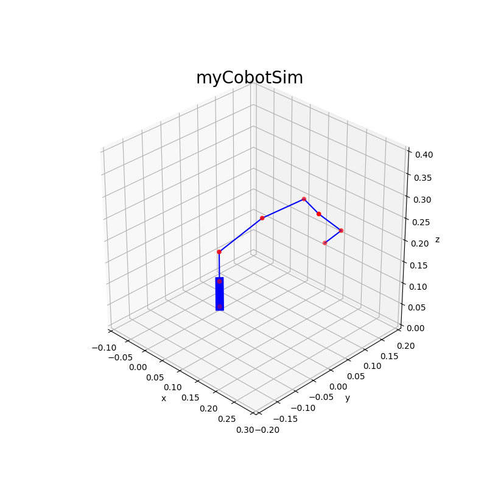
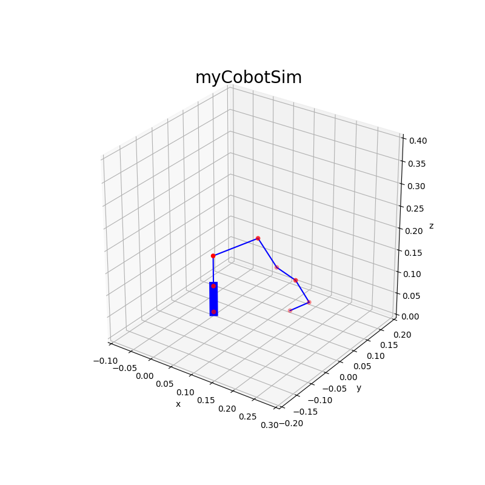

# PythonSimpleManipulation

## myCobot

Codes for myCobot.

### Requirements
1. numpy
1. matplotlib

### Forward Kinematics

#### How to run

```python
$ python3 myCobotFK.py
```

You can see random link positions of myCobot such like below pictures.
Poses are changed everytime.





# Author

Robonchu